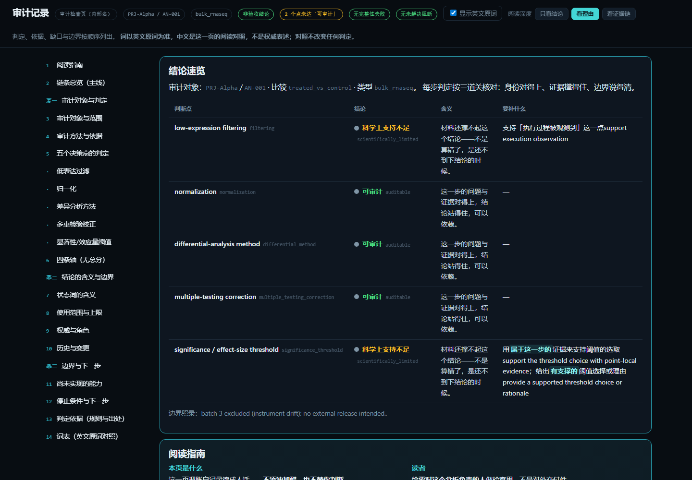
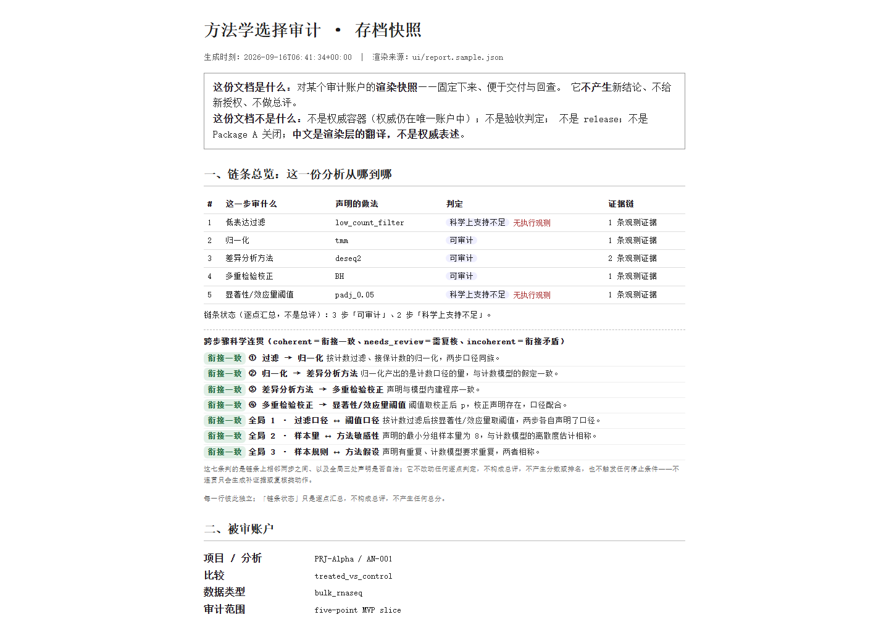
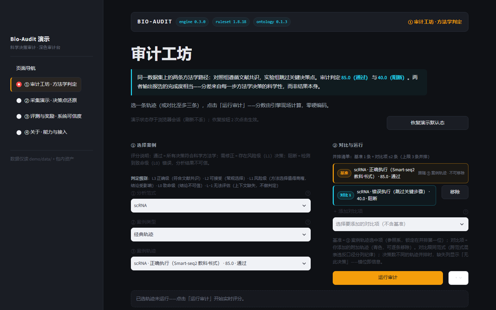

# bio-audit-dossier

**一份可随稿件或数据集交付的、有界的决策级审计记录。**

本仓库提供 Bio-Audit 体系的**审计交付面**：接收一次命名分析的方法学决策声明与执行观察，
逐点给出判定、依据、限制与停止条件，并产出可归档的交付件。
**本系统不对分析给出评分、排名或科学正确性结论。**

所属体系：[bio-audit](https://github.com/Tubo2333/bio-audit)（审计引擎、规则库、评测集与演示台）。
完整项目说明见 [README](https://github.com/Tubo2333/bio-audit-dossier#readme) ·
[English](https://github.com/Tubo2333/bio-audit-dossier/blob/main/README.en.md)。

---

## 一、它是什么

自动化分析流程在方法学层面可能出三类问题，且均不伴随运行错误：**声明与实际执行不一致**、
**预期决策点缺失**、**方法选择与上下文不适配**。这些问题无法通过代码审查或结果核对发现，
须对照领域方法学共识逐决策核验。本系统将该核验过程结构化，并使其结果可交付、可追溯、可复算。

被审对象是**一次命名的 bulk RNA-seq 差异表达分析**：

| 编号 | 决策点 | 该点回答的问题 |
|---|---|---|
| DP-01 | 低表达基因过滤 | 是否执行过滤、依据何种阈值、证据支持至何程度 |
| DP-02 | 标准化方法 | 所选方法与当前分析背景的适配性及其证据 |
| DP-03 | 差异分析方法 | 方法选择与统计问题、数据结构的相关性 |
| DP-04 | 多重检验校正 | 校正方法、其证据与限制 |
| DP-05 | 显著性与效应量阈值 | 阈值的解释力边界（不构成因果或生物学重要性判断） |

五个决策点相互独立、不得合并，亦不得以任一点的证据补足另一点的缺口。

## 二、它不做什么（本页最重要的一节）

- **不**给出分析评分、排名、质量总分或置信度；
- **不**判定科学正确性，亦不替代统计学家、复核方或领域专家的判断；
- **不**出具「通过 / 合格 / 可信 / 已验证」类结论词；
- **不**替代验收、发布或包级闭包的任何主张；
- 判定仅在其所声明的项目、分析与审计范围之内成立。

## 三、判定模型：分类判定，不是评分

| 判定 | 含义 | 系统行为 |
|---|---|---|
| **auditable** | 关键事实、上下文与证据可确认 | 给出该点的支持范围与限制 |
| **scientifically inadequate** | 事实基本清楚，但方法或证据仅支持较弱结论 | 保留可支持部分，显式声明限制 |
| **not auditable** | 关键事实、上下文或证据无法确认 | 停止受影响判定及其下游结论；不以默认值、相似项目或历史记录补齐 |
| **integrity / authority failure** | 身份、版本、来源、绑定、快照、权限或唯一权威关系失败 | 隔离受影响材料，保留待裁决事项；不降格为普通科学不足 |

证据的**来源类型**（`declared` / `observed` / `referenced` / `derived`）与**验证状态**
（`confirmed` / `unverified` / `conflicted` / `not_applicable`）分别记录、不得混同：
`declared` 不等于 `confirmed`，规则或文献不等于实际执行事实。

## 四、三项产物

| 产物 | 说明 |
|---|---|
| `report.json` | 结构化审计记录 |
| `report.html` | 检查页：供对分析负责者自行核查，含三档阅读深度（结论 / 理由 / 证据链）与判据面板 |
| `deliverable.html` | 交付件：单文件 HTML，含打印样式，可随稿件或数据集归档 |



*检查页（`report.html`）：五个决策点各给判定、依据与限制，不含总分。*



*交付件（`deliverable.html`）：单文件、可打印、可归档；受八条硬性约束，不得成为第二权威、不得合成单一评分、不得出现「通过 / 合格 / 可信 / 已验证」类结论词。*

## 五、与父仓库的关系

本仓库复用 [bio-audit](https://github.com/Tubo2333/bio-audit) 的引擎、规则库与决策本体，
但**审计记录不消费该引擎的聚合分数、等级、评测分或训练信号**。

| | bio-audit（父仓库） | 本仓库 |
|---|---|---|
| 面向 | 引擎、规则库、评测集、演示台 | 审计交付面、判据链、交付件、提交面 |
| 输出 | 轨迹评分、verdict、维度分、benchmark、reward | 分类判定、依据、限制、使用上限、受控动作 |
| 口径 | 可量化，供评测与回归使用 | 不可量化，仅供有界使用 |

**两个仓库的数值口径不得混写**：父仓库的分数不构成本仓库的结论，本仓库的判定亦不构成父仓库的评分。

## 六、四页交互式演示台

本仓库另含 `demo/`：一条命令启动的四页演示台（审计工坊 / 采集演示 / 评测与奖励 / 关于），
用于呈现引擎与评测层的运行方式。



**该演示台所述分数与 benchmark 属于父仓库口径，不属于本仓库审计记录的内容。**
演示台身份与降级声明见其页脚；启动方式见 [快速开始](docs/quickstart.html)。

## 七、一分钟上手

```bash
pip install -e ".[dev,a1]"          # 需要 Python >= 3.10；a1 附加项为网页提交表单所需

# 提交一次分析并产出三项交付物（默认写入 var/）
python scripts/submit_analysis.py --file <submission.json>

# 生成一份完整的示例提交（含反例，用于核验 fail-closed 行为）
python scripts/make_example_submission.py --out-dir _tmp_a1

# 网页提交表单（本地服务，默认端口 5050）
python ui/a1_submit_app.py --port 5050
```

Windows 环境可双击 `start-a1-web.bat` 启动提交表单，双击 `启动演示.bat` 启动四页演示台。

## 八、导航

| 入门 | 契约 | 工程 |
|---|---|---|
| [快速开始](docs/quickstart.html) | [API 契约](docs/api-contract.html) | [文档中心](docs/index.html) |
| [Quick start (English)](docs/quickstart.en.html) | [MCP 契约](docs/mcp-contract.html) | [规则贡献指南](https://github.com/Tubo2333/bio-audit-dossier/blob/main/CONTRIBUTING.md) |

工程核验命令：

```bash
python -m pytest -q                     # 全量测试
python ui/verify_report.py              # 检查页产物级断言（19 项）
python ui/verify_deliverable.py         # 交付件产物级断言（10 项）
python scripts/check_rule_lifecycle.py  # 规则库生命周期
```

## 九、边界声明

- 本系统**不**给出分析评分、排名、质量总分或置信度；
- 本系统**不**判定科学正确性，亦不替代统计学家、复核方或领域专家的判断；
- 本系统的判定仅在其所声明的项目、分析与审计范围之内成立；
- 交付件是某一时刻的**渲染快照**，不产生新结论、不授予新授权；
- 中文为渲染层翻译，非权威表述。

## 十、许可

[Apache-2.0](LICENSE)。
